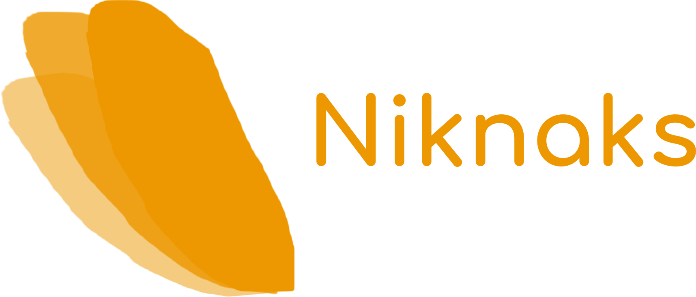

Niknaks
=======

    
[](https://coveralls.io/github/deavmi/niknaks?branch=master)

#### Helpful _niknaks_ or "things" that you may grasp for now and then

## Usage

To add the package to your project use the following:

```d
dub add niknaks
```

[**Now read the DOCS!**](https://niknaks.dpldocs.info/)

### Modules

Below is a short description of what each module provides, the list
is expected to grow over time.

* `niknaks.functional`
    * Predicates
    * Optionals


## License

LGPL 3.0

## Contributing

If there is something let me know or open a pull request for it. Try
to keep the implementation generic as in by using parameterized types
via D's templating capabilities.

Only make use of exceptions where it is absolutely necessary, normally
go for an exception-less implementation and have an exception-based
one which re-uses the former.

For more information please see [CONTRIBUTING](CONTRIBUTING.md).